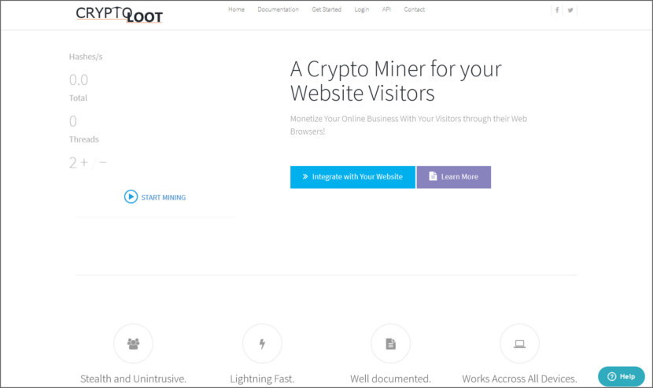
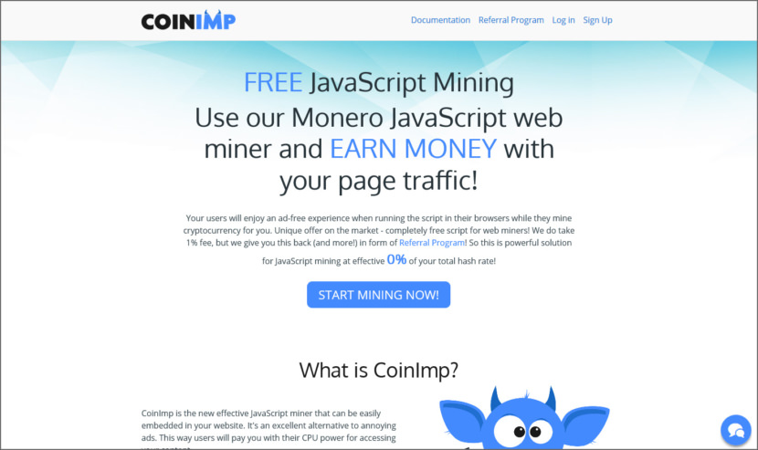
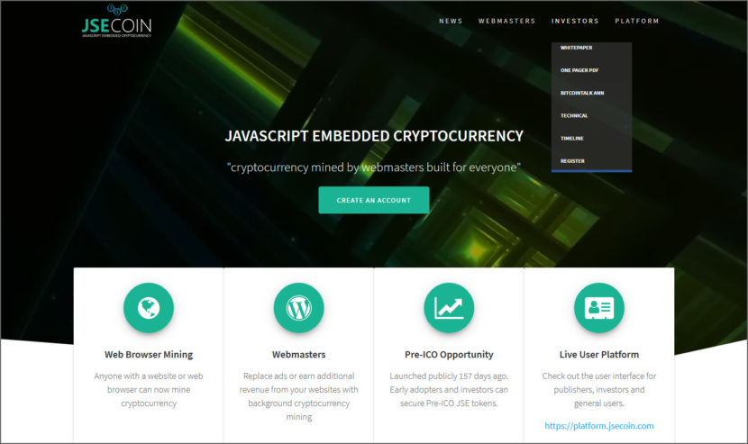

# 3 CryptoCurrency Mining JavaScripts – Mine Monero or MintMe.com Coin or UPX

At the time of writing, BitCoin and most of these Crypto-Currencies may have crashed, whether it is a bubble or not is a different story all together, what is certain is these crypto-currencies will always exist, in one form or another. Just like how social networks survived even though friendster and myspace died a slow and painful death.

As a webmaster, I do not recommend this, because speed is an important factor when it comes to ranking, slowing down your visitor’s PC is not a good idea. Furthermore, we’ve seen the rise of WordPress hacking involving inserting these cryptocurrency javascript. Personally, I think these scripts work best on simple gaming sites, where visitors tend to stay longer. You will need to have their permission to run these script.

##  01 – [Crypto-Loot](https://bit.ly/2JWTGXr)

Crypto-Loot offers a Browser based web miner for the Monero Blockchain that you can embed on your websites. They utilize Monero as it is the most fitting for web based mining, and supports the underlying principles of privacy. Your visitors automatically run the miner in their Browser and mine XMR for you in return for an ad-free experience, on-site currency or whichever incentives you decide on.

- Stealth and Unintrusive – Running our miner on your webite will go unnoticed by users after they click run if you set threads between 2-4.
- Lightning Fast – Our service utilizes lightning fast connections, DDoS protection, multiple websocket proxies, firewalls, and multiple database servers to ensure 99.9998% mining uptime!
- Works Accross All Devices – Our silent miner works accross all devices: Desktops, Laptops, Tablets, Phones, Windows, Linux, and iOS.

[Try Demo](./cryptoloot/index.html)

##  02 – [CoinImp](https://bit.ly/2Rtig6i)

CoinImp is the new effective JavaScript miner that can be easily embedded in your website. It’s an excellent alternative to annoying ads. This way users will pay you with their CPU power for accessing your content.

With CoinImp, Monero is mined by using your visitors CPU resources which would be otherwise wasted. Why not Bitcoin, Ethereum or any other? Because Monero value is quite high and it can be mined with similar efficiency by CPU and GPU, while mining other cryptocurrencies with CPU makes no financial sense.

Our JavaScript miner has more advantages than other javascript mining solutions. Their miner isn’t blocked by Anti-viruses or AdBlock and if it gets blocked eventually, they react and work hard to unblock it.

[Try Demo](./coinmp/index.html)

## 03 – [JSEcoin](https://bit.ly/2UYVlC3)

Cyrptocurrencies are traditionally mined by industrial sized server farms setup next to power stations consuming vast amounts of electricity. Their platform saves energy and allows webmasters to monetize their websites by replacing the role of cryptocurrency miners.

Website visitors carry out the mathematical hashing process in the background while browsing a website using excess CPU power which would be otherwise wasted. An unobtrusive code snippet placed on the website runs in the browser while a visitor is on the page. This provides the hashing functionality required to secure the blockchain.

[Try Demo](./jsecoin/index.html)

